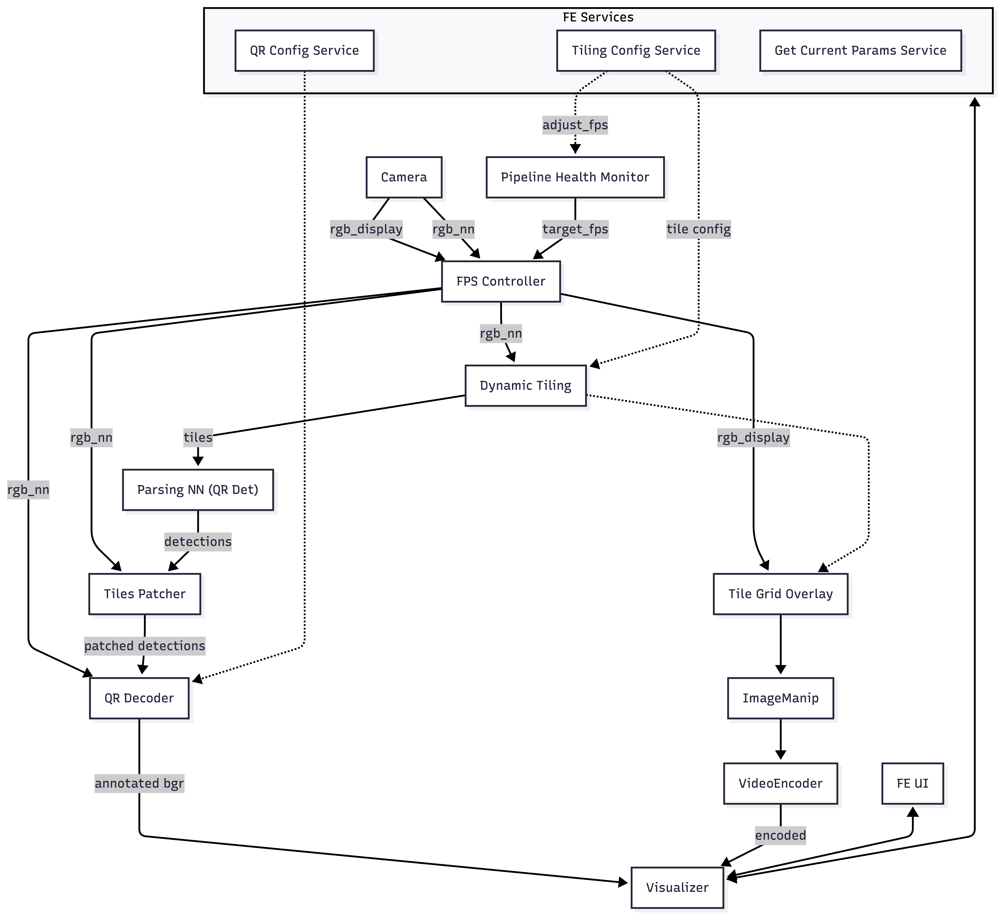

# QR Tiling Detection

This application demonstrates high-resolution QR code detection using dynamic image tiling, running fully on-device with a live frontend for configuring the tiling grid.

**It runs QR detection on the DepthAI backend with dynamic tiling, and exposes controls in the UI for:**

- Configuring grid size (rows and columns)
- Adjusting tile overlap percentage
- Merging tiles into custom regions via interactive grid editor
- Enabling global detection (full-frame pass)
- Real-time tile grid visualization overlay

> **Note:** RVC4 standalone mode only.


______________________________________________________________________

## Features

- **Dynamic tiling for high-resolution detection**

  - Split high-resolution frames into smaller tiles for neural network inference
  - Configurable grid size up to 8×8 tiles
  - Adjustable overlap between tiles to catch QR codes on boundaries

- **QR code decoding**

  - Detects QR codes using neural network
  - Decodes QR content using pyzbar
  - Displays decoded URLs/text as annotations

- **Custom tile merging**

  - Interactive grid editor in the UI
  - Click to select cells, click adjacent cells to merge
  - Create custom tile regions for optimized detection areas

- **Global detection mode**

  - Optional full-frame inference pass
  - Catches large QR codes that span multiple tiles

- **Real-time visualization**

  - Tile grid overlay on video stream
  - Color-coded tiles with blended overlap regions
  - Live tile count display

- **Runtime configuration**

  - Update tiling parameters without restarting
  - UI state synchronized with backend
  - Configuration persists across UI refreshes

- **Adaptive FPS control**

  - Monitors pipeline backpressure (BLOCKED input queues) and adjusts FPS to prevent overload
  - Estimates safe FPS from node timing data when tile count increases
  - Gradually ramps FPS back up after tile count decreases

______________________________________________________________________

## Architecture



______________________________________________________________________

## Usage

Running this example requires a **Luxonis RVC4 device** connected to your computer.
Refer to the [documentation](https://docs.luxonis.com/software-v3/) to set up your device if you haven't already.

______________________________________________________________________

## Standalone Mode (RVC4)

To run the example in standalone mode, first install the `oakctl` tool using the instructions [here](https://docs.luxonis.com/software-v3/oak-apps/oakctl).

The app can then be run with:

```bash
oakctl connect <DEVICE_IP>
oakctl app run .
```

Once the app is built and running you can access the DepthAI Viewer locally by opening `https://<OAK4_IP>:8082/` in your browser (the exact URL will be shown in the terminal output).

### Remote Access

You can upload the oakapp to Luxonis Hub via `oakctl` and then remotely open the App UI via the App detail page.

______________________________________________________________________

## Configuration

> **Note:** FPS may drop briefly after increasing tile count (to prevent overload) and will gradually ramp back up after decreasing the tile count.

### Tiling Parameters

| Parameter          | Range    | Default | Description                               |
| ------------------ | -------- | ------- | ----------------------------------------- |
| `rows`             | 1-8      | 2       | Number of tile rows                       |
| `cols`             | 1-8      | 2       | Number of tile columns                    |
| `overlap`          | 0.0-0.99 | 0.2     | Overlap percentage between adjacent tiles |
| `global_detection` | bool     | false   | Include full-frame inference pass         |
| `grid_matrix`      | 2D array | null    | Custom tile merging configuration         |

### Resolution Settings

Defined in `main.py`:

```python
TILING_SIZE = (3840, 2160)
OUT_SIZE = (1920, 1080)
```
